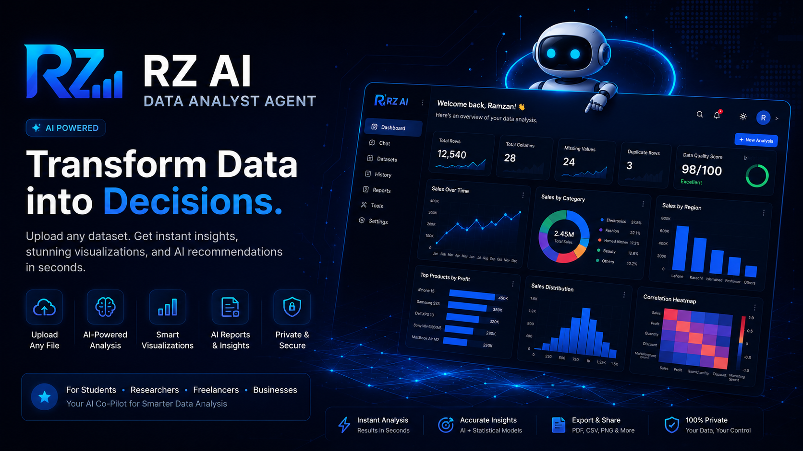
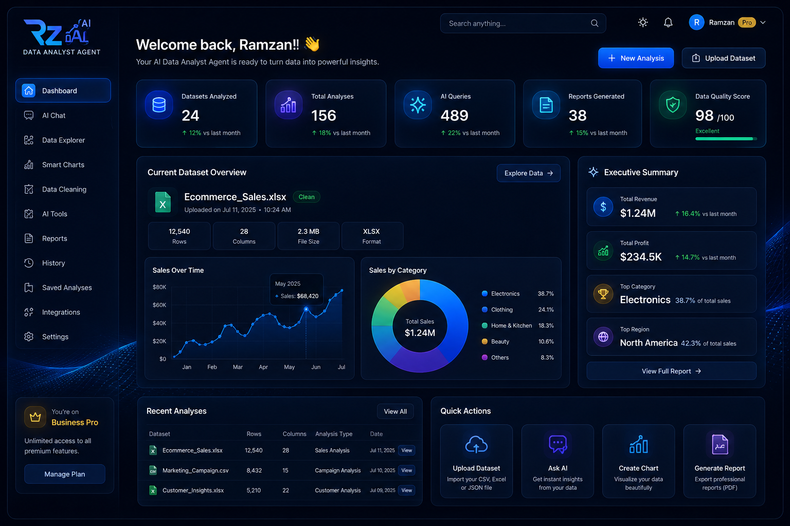
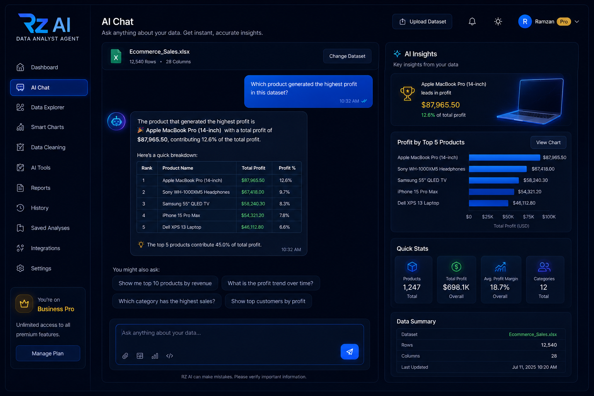
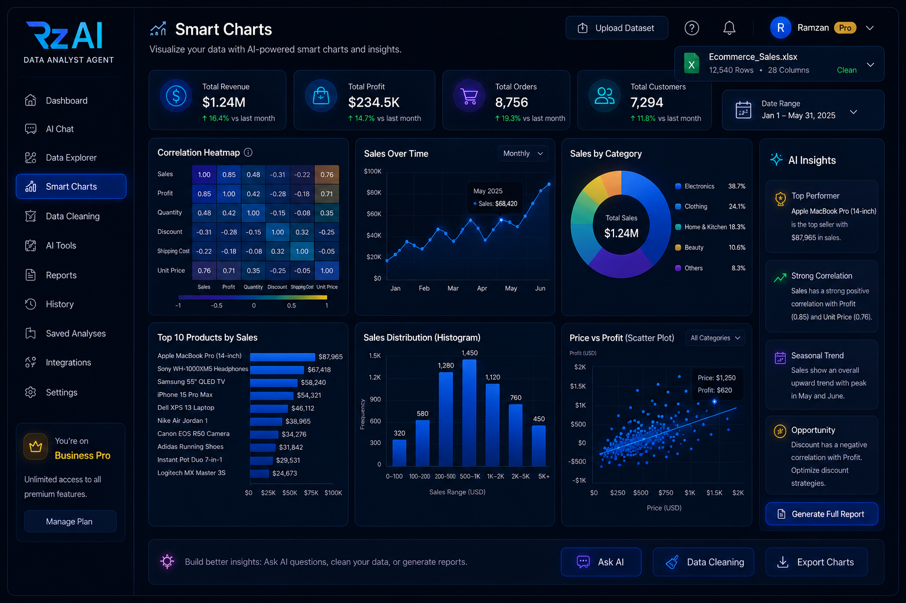
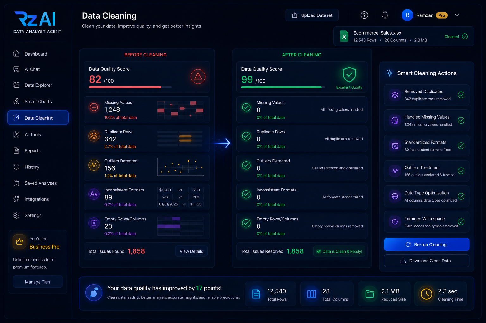
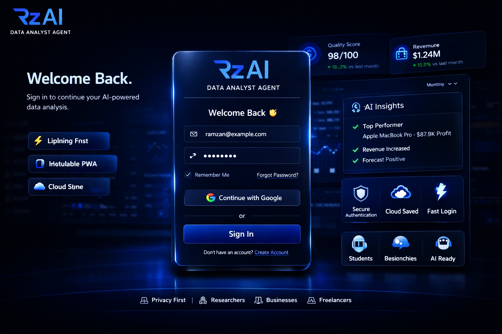
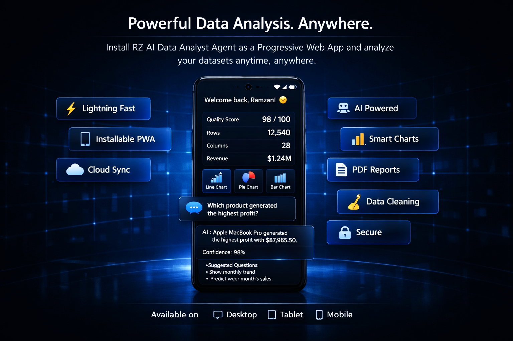

<div align="center">



# 📊 RZ Data Analytics AI Agent

### Stop staring at spreadsheets. Start asking them questions.

Drop in a file. Get real dashboards, real answers, and an AI analyst that actually computes your numbers instead of guessing at them — free, in your browser, in seconds.

[](https://aistudio.google.com)
[](https://vercel.com)
[](https://supabase.com)
[]()
[]()

### [**🚀 Try it live → rz-data-analytics-ai-agent.vercel.app**](https://rz-data-analytics-ai-agent.vercel.app/)

[✨ Features](#-features) · [⚡ Quick Start](#-quick-start) · [🛠️ Tech Stack](#️-tech-stack) · [🔐 Security](#-security)

</div>

---

## The problem this solves

You have a spreadsheet. You want answers, not a formula reference tab open in another window. Most "AI + your data" tools either can't actually see your whole dataset, or they confidently make numbers up. **RZ doesn't** — every number it gives you is computed by a real engine running against your *entire* file, not eyeballed by a language model from a sample. Ask it "what's the correlation between price and profit" and it runs the actual math. Ask it to forecast next quarter and it fits a real trend line — with an honest confidence caveat, not false certainty.

Upload a **CSV, Excel, or JSON** file. Get instant charts, a data-quality score, anomaly detection, and a chat-based analyst that can write your SQL, explain your outliers, and generate a full report — in plain English, in one page, with nothing to install.

## ✨ Features

| | |
|---|---|
| 📁 **Any file, any source** | CSV, XLSX, JSON, pasted data, or a direct URL import |
| 🎯 **Numbers you can trust** | Real computation engine — not AI-estimated guesses from a data sample |
| 🤖 **A conversation, not a search bar** | Ask follow-ups, request a full report, get SQL written for you — it remembers the thread |
| 📈 **Instant dashboards** | Auto-generated charts, correlation heatmaps, and a data-quality score the moment a file loads |
| 🔍 **Anomaly detection** | Duplicates, missing values, statistical outliers, and impossible values flagged automatically |
| 🧮 **Excel & SQL on demand** | Dedupe, fill missing values, generate SQL queries, export cleaned CSVs |
| 📋 **One-click deliverables** | Full reports, PDF export, assignment mode, presentation scripts, Power BI suggestions |
| 🖼️ **Real multimodal input** | Attach an image or PDF and the AI reads it directly |
| 🎨 **Make it yours** | Dark/light theme, 5 accent colors, adjustable response style |
| 🔒 **Privacy-first** | Export or permanently delete all your data at any time |
| 📱 **Installable PWA** | Add to your home screen, use it like a native app |
| 🆓 **Genuinely free tier** | Daily free messages, unlimited on Pro |

## ⚡ Quick Start

Want to run your own instance? Here's the whole setup:

### 1. Clone & configure

```bash
git clone https://github.com/<your-username>/rz-ai-data-analyst.git
cd rz-ai-data-analyst
```

### 2. Set up Supabase

1. Create a project at [supabase.com](https://supabase.com).
2. Run the SQL in [`supabase_rate_limit.sql`](./supabase_rate_limit.sql) in the SQL editor — this sets up atomic, server-side rate limiting.
3. Grab your **Project URL**, **anon key**, and **service_role key** from Project Settings → API.

### 3. Get a free Gemini API key

Grab one at [aistudio.google.com/apikey](https://aistudio.google.com/apikey) — no credit card needed.

### 4. Deploy to Vercel

```bash
vercel deploy
```

Add these environment variables in your Vercel project settings:

| Variable | Where it's used | Keep secret? |
|---|---|---|
| `GEMINI_API_KEY` | `/api/chat` → calls Gemini | ✅ server-only |
| `SUPABASE_URL` | `/api/chat` → verifies sessions & rate limits | can be public |
| `SUPABASE_SERVICE_ROLE_KEY` | `/api/chat` → bypasses RLS to enforce limits | ✅ **never expose client-side** |

That's it — the frontend (`index.html`) needs no build step; it's a single static file.

## 🛠️ Tech Stack

- **Frontend** — Vanilla JS, no framework, no build step (one HTML file)
- **AI** — [Google Gemini](https://ai.google.dev/) (`gemini-2.5-flash-lite`) with real function-calling for exact computation
- **Backend** — Vercel Serverless Functions
- **Database & Auth** — [Supabase](https://supabase.com) (Postgres + Row Level Security)
- **Parsing** — PapaParse (CSV), SheetJS (Excel), off the main thread via a Web Worker

## 🔐 Security

- Every AI request is authenticated against a real Supabase session — not just trusted from the client.
- Daily free-tier limits are enforced **atomically in Postgres**, closing the race condition that plagues naive check-then-write rate limiting.
- Dataset content sent to the AI is sanitized and explicitly marked as untrusted data, not instructions — mitigating prompt injection from malicious spreadsheet content.
- Users can export or permanently delete all their stored data at any time.

## 🔭 Vision

Concept renders for where the product is headed — a full multi-page dashboard (Data Explorer, standalone AI Tools, Saved Analyses, Integrations). **These are early concept art, not the current live UI** — today's RZ Data Analytics AI Agent is the single-page chat app described above. Included here to show direction, not to overstate what's shipped.

<table>
<tr>
<td width="50%"><br/><sub align="center">Dashboard overview</sub></td>
<td width="50%"><br/><sub>AI chat with insights panel</sub></td>
</tr>
<tr>
<td width="50%"><br/><sub>Smart charts page</sub></td>
<td width="50%"><br/><sub>Before/after data cleaning</sub></td>
</tr>
<tr>
<td width="50%"><br/><sub>Login screen</sub></td>
<td width="50%"><br/><sub>Installable mobile PWA</sub></td>
</tr>
</table>

## 🗺️ Roadmap

- [ ] Streaming AI responses
- [ ] Multi-sheet Excel support
- [ ] Dedicated Data Explorer / Saved Analyses pages (see Vision above)
- [ ] Team workspaces
- [ ] Native chart export to PowerPoint

## 🤝 Contributing

Issues and PRs are welcome — open an issue first for anything beyond a small fix so we can talk through the approach.

## 📄 License

MIT — do what you want with it, just don't remove the credit.

---

<div align="center">

Built solo by **Rz Baloch** — mathematics student at CASPAM, Bahauddin Zakariya University, Multan.

**[👉 Try RZ Data Analytics AI Agent now](https://rz-data-analytics-ai-agent.vercel.app/)**

<sub>Star ⭐ this repo if it saved you from opening Excel one more time.</sub>

</div>
